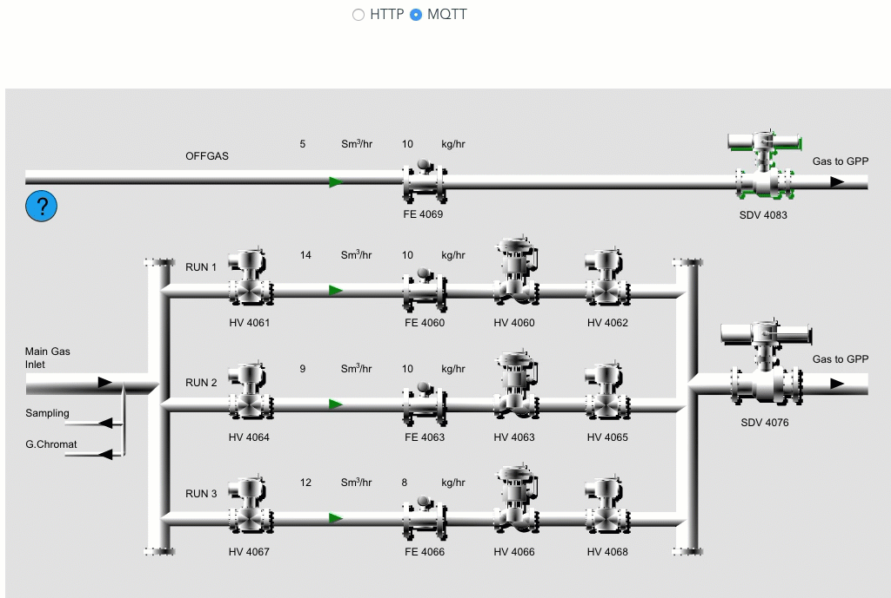

# Jike-scada

[](https://travis-ci.org/noru/jike-scada)
[](https://coveralls.io/github/noru/jike-scada?branch=master)



## Install

`npm i --save noru/jike-scada`

or use built file under `dist` folder

## Usage

Prerequisite: render your **embeded** svg in DOM already. `` won't work because it has no DOM within.

```javascript
import JScada from 'jike-scada' // or 'dist/jscada.min.js' if you like

let source = {
  id: 'mqtt-source',
  type: 'mqtt',
  url: 'ws://localhost:3000',
  tags: [
    {
      id: 'path18456',
      type: 'fill',
    }
  ]
}

let JScadaOptions = {
  autoStart: true,
  svg: '#svg-container', // <svg> or <embed> element selector
  sources: [ source ],
}

let jscada = new JScada(JScadaOptions)

jscada.close() // call this when you stop digesting data

```

The defination of `OPTIONS` is down below. Check the [example](#example) for more details

## Options

```typescript

export interface JScadaOptions {
  // <svg> or <embed> element selector
  svg: string,
  // see JScadaSource
  sources: JScadaSource[]

  /* optional */
  // instance id, will automatically generated if not supplied
  id?: string,
  // out debug message or not
  debug?: boolean = false,
   // if not, you have to call `instance.start()` yourself to start receiving data
  autoStart?: boolean = false,
}

export interface JScadaSource {

  // source id, must be unique within one instance
  id: string,
  // JScadaAdaptorType = 'http' | 'ws' | 'mqtt' | 'manual'
  type: JScadaAdaptorType,
  // e.g. ws://my.host.com:3000 or http://my.host.com/api
  url: string,
  // see JScadaTag
  tags: JScadaTag[],
  /* optional*/
  // (On going...) extra parameters, e.g. http headers:
  //
  //   params: {
  //     headers: {
  //       Authorization: 'token'
  //     }
  //   }
  //
  params?: any,
}


export interface JScadaTag {

  // tag id. will be used as tag id if selector is not supplied
  id: string,
  // used by `document.querySelectorAll()` to select element.
  // if not supplied, id will be used as element id and called as:
  // `document.getElementById(id)`
  selector?: string,
  // MounterType = 'text' | 'fill' | 'stroke' | 'visible' | 'opacity'
  type: MounterType,
  // project response data to the final type. for example, if your response is:
  // {
  //   age: 15 // a 0 - 100 number
  // }
  // and the target is a text showing it's an adult or not, your projector can be:
  // function(data) {
  //   return data.age > 18 ? 'adult' : 'teenager'
  // }
  //
  projector?: (input: any) => any,
  // similiar to projector, only pick a value from an object by path. e.g.
  //
  // let object = { 'a': 1, 'b': { c: 'myValue' } };
  // the path of `myValue` is 'b.c'
  //
  // array is supported as well:
  // 'SomeProp.SomeArray[0].MyValue'
  path?: string,

}

```

## Example

To run the example
```
cd <path>/example/jscada-vue-example
npm install
npm run dev
```

**Caveat**

1. I'm using mock http server in code(JScadaExample.vue, line 191), to see a poping data please change it to your service

2. To receive mqtt data, you have to start a local mqtt broker, and publish message to it externally.

To start a local broker
```sh
npm i -g mosca
mosca -v --http-port 3000
```

To publish a message

```sh
npm i -g mqtt
mqtt pub -t '#' -h 'localhost' -m "$MSG"
```

You can create a script and run it, like this. It generates random value and publish it every 1 second
```sh
#!/bin/bash
while true

MSG=$(cat <<EOF
{
  "a": "$(( ( RANDOM % 10 ) + 1 ))",
  "b": "$(( ( RANDOM % 20 ) + 1 ))",
  "c": "$(( ( RANDOM % 20 ) + 1 ))",
  "d": "$(( ( RANDOM % 20 ) + 1 ))",
  "e": "$(( ( RANDOM % 20 ) + 1 ))",
  "f": "$(( ( RANDOM % 20 ) + 1 ))",
  "g": "$(( ( RANDOM % 20 ) + 1 ))",
  "h": "$(( ( RANDOM % 20 ) + 1 ))"
}
EOF
)

do

  echo "Sending message: ${MSG}"
  mqtt pub -t '#' -h 'localhost' -m "$MSG"
  sleep 1

done
```


TODO:

1. unit test relies on local mqtt server(ws://localhost:3000)

