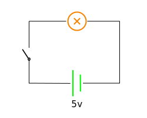
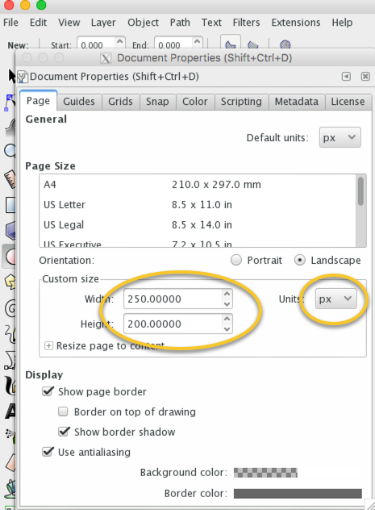
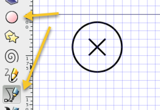
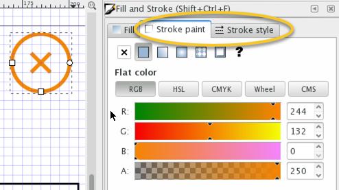
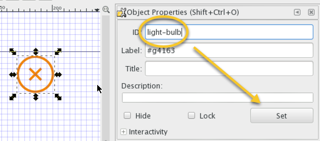
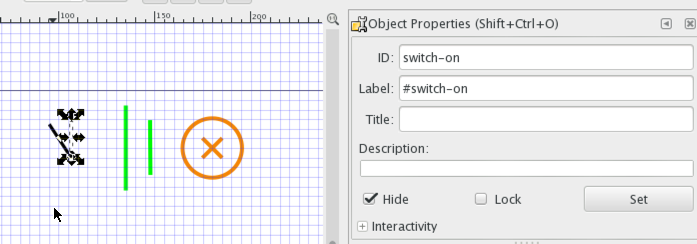
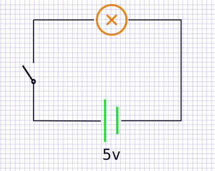

# Drawing SVG

SVG全称Scalable Vector Graphics, 可缩放矢量图形. SVG标准由W3联盟制定, 是一个基于可扩展标记语言(XML)的开放标准. SVG具有良好的传输性好, 可伸缩, 而且方便读取和修改. 因此是web scada最合适的图形解决方案. 

`jike-scada`也是基于svg进行图形界面的修改操作, 但`jike-scada`并不引入额外的图形定义, 只要是符合SVG v1.1标准(https://www.w3.org/TR/SVG/)和具有能够定位元素的id或选择器即可. SVG的生成和编辑可以使用任意编辑器进行(如: Illustrator, Sketch, Inkscape, anigen).

下面以Inkscape为例, 创建一个简单的scada界面.

## 目标



- 一个简单的开关灯泡的电路图
- 灯泡和电源通过颜色变化表达状态
- 电池的电压数值通过数字来表示
- 开关有开和关两种外观, 对应响应状态

## 开始

1. 打开inkscape, 创建新的文档. `File` -> `Document Properties`, 在对话框中调整画布大小, 也就是最终svg的宽高, 这里选择250*200px



2. 在画布上, 使用圆圈和直线工具画出一个表示灯泡的图形. 打开辅助线(`View` -> `Page Grid`)以便对齐.



3. 在`Fill and Stroke`窗口页面, 选择合适的颜色和线条宽度.



4. 选中圆圈和叉, 右键, 选择`Group`, 把他们合并为一组, 方便编辑.

5. 重要! 选择整个group, 在`Object Properties`窗口中(右键, 选择`Object Properties`), 指定这个图形的id为`light-bulb`. 这个id需要提供给`jike-scada`以便定位元素并作出一系列更改.




6. 重复2-5类似的步骤, 画出电源和开关的图形. 注意这里的开关由于有两个状态, 可通过隐藏其中给一个状态的图形来表示当前状态. 默认开关为关闭状态.



7. 用直线工具画出电路, 拖动图形调整位置, 加入文字元素, 完成电路图. 注意, 可变文字部分最好使用单独的元素并赋予独立的id, 例如图中的数字`5`, 电压单位由于并不需要变化所以无需特别处理.



8. 保存文件为svg, 完成. 可在浏览器中打开, 查看元素的id等信息是否正确.


## 使用

在实际使用中, 前端获得的传感器信息有时信息完整, 有时需要计算或者推到. 以这个电路图为例, 传感器完整信息可能包括:

- 开关on/off
- 灯泡亮度
- 电池电量, 电压

但更多时候, 我们不可能也不需要这么全面的信息, 例如我们只需要电压信号即可推到出其他所有状态:

- 开关on/off, 电压值是否为0
- 灯泡亮度,电量均与电压成一定函数关系

这里假设亮度和电量与电压的关系为简单的线性关系, 并且假设传感器通过mqtt协议返回如下JSON信息:
```json
{
  "volt": 5  // or other number
}
```

对应的, 完整的`jike-scada`配置及用法如下:

```javascript

function getLightBulbColorByVolt(volt) {
  let luminance = (volt - 5) / 5
  return colorLighten(luminance)
}

function getBatteryColorByVolt(volt) {
  // similar to getLightBulbColorByVolt
}

let source = {
  id: 'mqtt-source',
  type: 'mqtt',
  url: 'ws://localhost:3000',
  tags: [
    {
      id: 'light-bulb', // corresponding to svg element id
      type: 'stroke',
      projector: volt => {
        return getLightBulbColorByVolt(volt)
      }
    },
    {
      id: 'battery',
      type: 'stroke',
      projector: volt => {
        return getBatteryColorByVolt(volt)
      }
    },
    {
      id: 'battery-volt',
      type: 'text',
      path: 'volt',
    },
    {
      id: 'switch-on',
      type: 'visible',
      projector: volt => {
        return volt > 0
      }
    },
    {
      id: 'switch-off',
      type: 'visible',
      projector: volt => {
        return volt === 0
      }
    }
  ]
}

let JScadaOptions = {
  sources: [ source ],
}

let jscada = new JScada(JScadaOptions)
jscada.start()
jscada.close() // call this when you stop digesting data

```

TODO:
- make it a live example
- fix bugs in j-scada to fit SVG v1.1 spec